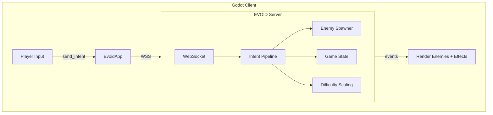

# Top-Down Shooter

Build a top-down survival shooter. Waves of enemies chase the player. The server controls spawning, difficulty, and scoring. The client handles input and rendering.

## What We're Building



**Architecture**: The server is authoritative. Clients send intents (move, shoot). The server validates, updates state, and broadcasts events. No client can cheat because the server decides everything.

**Based on**: HuntSquare, a minimal top-down shooter using only 2 textures (Square.png, Circle.png). Every entity is a colored square.

## Features

- WASD movement + mouse-click shooting
- 3 enemy types with different stats (speed, HP, points)
- Progressive difficulty (spawn rate increases over time)
- Server-authoritative game state
- Score + highscore tracking
- Screen shake + blood particle effects
- Room-based multiplayer
- WebGL export with instant loading

## Project Structure

```
top-down-shooter/
├── client/                         # Godot project
│   ├── addons/evoid_godot/         # EVOID plugin
│   ├── scenes/
│   │   ├── World.tscn              # Main game scene
│   │   ├── Player.tscn             # Player entity
│   │   ├── Enemy.tscn              # Base enemy template
│   │   ├── Enemy_0.tscn            # Red: fast, low HP
│   │   ├── Enemy_1.tscn            # Teal: slow, tanky
│   │   ├── Enemy_2.tscn            # Purple: fast, fragile
│   │   ├── Bullet.tscn             # Projectile
│   │   ├── HUD.tscn                # Score + highscore
│   │   └── Blood.tscn              # Death particle effect
│   └── scripts/
│       ├── World.gd                # Game controller
│       ├── Player.gd               # Movement + shooting
│       ├── Enemy.gd                # Enemy behavior
│       ├── Bullet.gd               # Bullet physics
│       └── HUD.gd                  # UI updates
├── server/
│   ├── main.py                     # EVOID server entry
│   ├── game.py                     # Game state + spawning
│   └── requirements.txt
```

## How IOP Applies

| Concept | HuntSquare (Before) | EVOID Version (After) |
|---------|--------------------|-----------------------|
| Global state | `Global.gd` autoload singleton | Intent metadata + server state |
| Enemy spawn | Timer in `World.gd` | `enemy_spawn` Intent on server |
| Player move | Direct position update | `player_move` Intent → validate → broadcast |
| Score | `Global.points` variable | `score_update` Intent → persist |
| Difficulty | Timer decrement | `difficulty_tick` Intent → server decides |

The server owns all game state. Clients are dumb renderers that send inputs and receive events.

## Tutorials

1. **[Server Setup](shooter-server.md)**: game logic, enemy spawning, difficulty scaling
2. **[Client Setup](shooter-client.md)**: Godot scenes, player controller, enemy behavior
3. **[Multiplayer](shooter-multiplayer.md)**: room system, state sync, disconnects
4. **[Web Export](shooter-web.md)**: WebGL deployment, instant loading

## Next

Start with [Server Setup](shooter-server.md).
